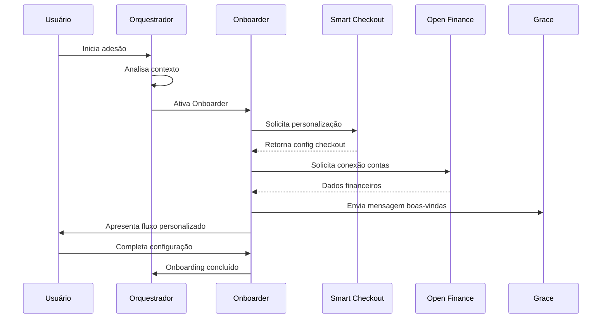
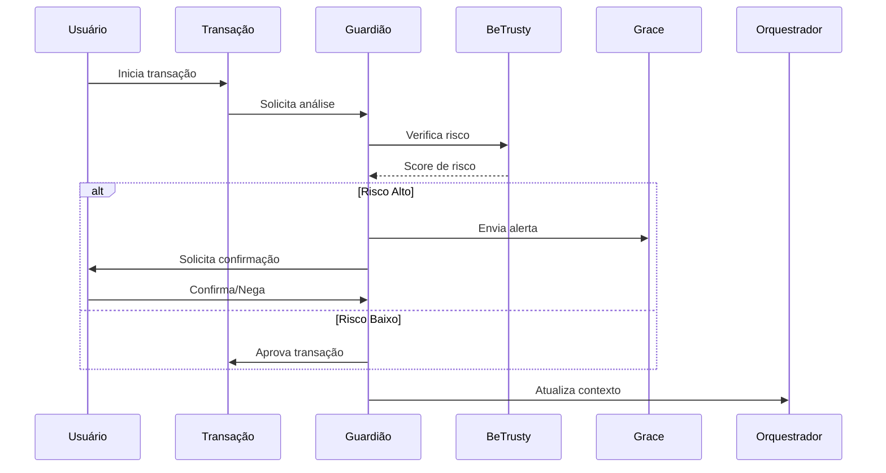
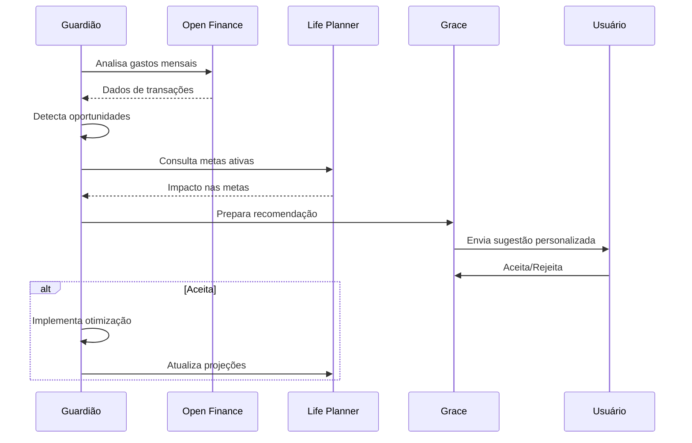
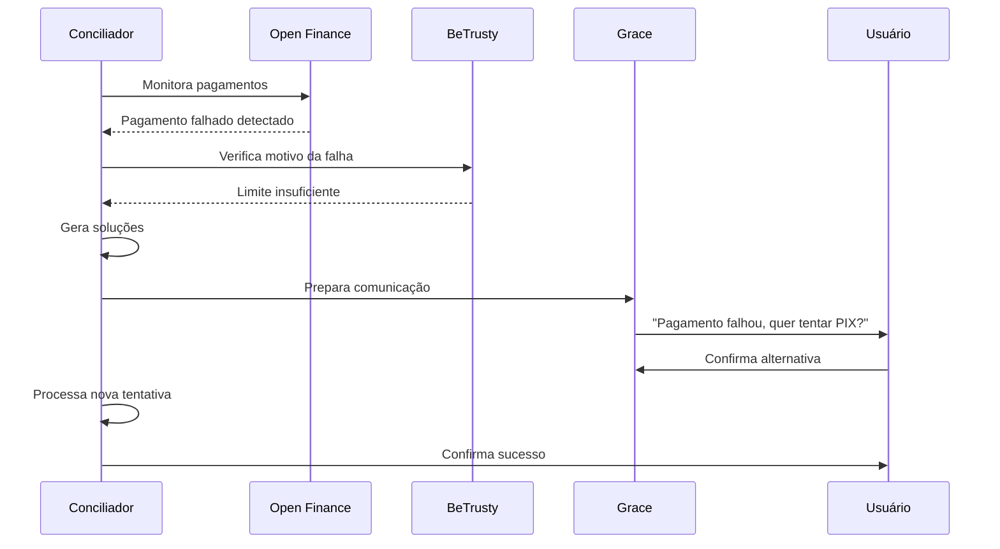

# 🏗️ **ARQUITETURA BACKEND - BEMOBI CONNECT AI**
## **Documentação de Arquitetura e Especificações de API**

---

## 📋 **1. VISÃO GERAL DO SISTEMA**

### **Conceito Central**
Sistema de 4 agentes de IA especializados que atuam como copilotos financeiros, integrando-se ao ecossistema Bemobi (Grace, Smart Checkout, BeTrusty) para oferecer experiência personalizada na jornada completa de pagamentos.

### **Arquitetura Conceitual**
```
┌─────────────────────────────────────────────────────────────┐
│                  CAMADA DE APRESENTAÇÃO                     │
│           (Web App, Mobile App, WhatsApp)                  │
├─────────────────────────────────────────────────────────────┤
│                  CAMADA DE INTEGRAÇÃO                       │
│              (API Gateway + Load Balancer)                 │
├─────────────────────────────────────────────────────────────┤
│                  CAMADA DE NEGÓCIO                          │
│  ┌─────────────┬─────────────┬─────────────┬─────────────┐  │
│  │   AGENTE    │   AGENTE    │   AGENTE    │   AGENTE    │  │
│  │ ORQUESTRADOR│ ONBOARDER   │ CONCILIADOR │ GUARDIÃO    │  │
│  │             │             │             │ FINANCEIRO  │  │
│  │             │   AGENTE    │             │             │  │
│  │             │LIFE PLANNER │             │             │  │
│  └─────────────┴─────────────┴─────────────┴─────────────┘  │
├─────────────────────────────────────────────────────────────┤
│                  CAMADA DE DADOS                            │
│  ┌─────────────┬─────────────┬─────────────┬─────────────┐  │
│  │   DADOS     │   DADOS     │    CACHE    │  MACHINE    │  │
│  │ TRANSACIONAIS│ ANALÍTICOS │  DISTRIBUÍDO│  LEARNING   │  │
│  └─────────────┴─────────────┴─────────────┴─────────────┘  │
├─────────────────────────────────────────────────────────────┤
│                CAMADA DE INTEGRAÇÃO EXTERNA                 │
│  ┌─────────────┬─────────────┬─────────────┬─────────────┐  │
│  │    GRACE    │ SMART CHECK │  BETRUSTY   │OPEN FINANCE │  │
│  │     API     │     API     │     API     │    APIS     │  │
│  └─────────────┴─────────────┴─────────────┴─────────────┘  │
└─────────────────────────────────────────────────────────────┘
```

---

## 🤖 **2. ESPECIFICAÇÃO DOS AGENTES**

### **A. AGENTE ORQUESTRADOR**
**Função**: Coordenação central e roteamento inteligente

**Responsabilidades:**
- Analisar contexto do usuário e decidir qual agente especializado ativar
- Manter continuidade de contexto entre canais (app ↔ WhatsApp ↔ web)
- Aplicar regras de negócio e compliance (LGPD, PCI-DSS)
- Gerenciar fluxos de trabalho complexos entre agentes

**Endpoint Principal:** `POST /api/v1/orchestrator/route`

**Dados de Entrada:**
```json
{
  "userId": "string",
  "sessionId": "string", 
  "channel": "app|whatsapp|web|ivr",
  "userIntent": "string",
  "contextHistory": "object",
  "riskProfile": "low|medium|high",
  "currentLocation": "object",
  "deviceFingerprint": "string"
}
```

**Dados de Retorno:**
```json
{
  "selectedAgent": "onboarder|conciliador|guardiao|planner",
  "confidence": "number (0-100)",
  "reasoning": "string",
  "nextActions": ["array"],
  "contextUpdate": "object",
  "estimatedResolutionTime": "number (seconds)"
}
```

**APIs Complementares:**
- `POST /api/v1/orchestrator/context/sync` - Sincronizar contexto entre canais
- `GET /api/v1/orchestrator/session/{userId}` - Recuperar sessão ativa
- `PUT /api/v1/orchestrator/rules` - Atualizar regras de roteamento

---

### **B. AGENTE ONBOARDER**
**Função**: Adesão e configuração personalizada

**Responsabilidades:**
- Guiar adesão a novos serviços com base no perfil do usuário
- Configurar métodos de pagamento otimizados por localização
- Integrar com Smart Checkout para personalização visual
- Adaptar fluxo para regulamentações locais (Brasil, México, Colômbia, etc.)

**Endpoint Principal:** `POST /api/v1/onboarder/configure`

**Dados de Entrada:**
```json
{
  "userId": "string",
  "serviceType": "subscription|one-time|recurring",
  "userLocation": {
    "country": "BR|MX|CO|AR",
    "state": "string", 
    "city": "string"
  },
  "availablePaymentMethods": ["pix", "card", "boleto", "oxxo", "pse"],
  "userPreferences": {
    "language": "pt|es|en",
    "currency": "BRL|MXN|COP|ARS",
    "communicationChannel": "whatsapp|sms|email"
  },
  "complianceRequirements": ["kyc", "lgpd", "gdpr"]
}
```

**Dados de Retorno:**
```json
{
  "recommendedPaymentMethod": {
    "primary": "pix|card|boleto|oxxo|pse",
    "alternatives": ["array"],
    "reasoning": "string",
    "discountAvailable": "number"
  },
  "customizedCheckoutConfig": {
    "theme": "object",
    "layout": "simplified|detailed|mobile",
    "fieldsRequired": ["array"],
    "localizations": "object"
  },
  "onboardingSteps": [
    {
      "stepId": "string",
      "title": "string",
      "description": "string",
      "estimatedTime": "number",
      "required": "boolean"
    }
  ],
  "complianceStatus": "approved|pending|rejected|additional_info_needed"
}
```

**APIs Complementares:**
- `GET /api/v1/onboarder/methods/{country}` - Métodos disponíveis por país
- `POST /api/v1/onboarder/validate` - Validar dados de onboarding
- `GET /api/v1/onboarder/progress/{userId}` - Progresso do onboarding

---

### **C. AGENTE CONCILIADOR**
**Função**: Gerenciamento proativo e suporte contextual

**Responsabilidades:**
- Responder dúvidas sobre faturas e histórico de pagamentos
- Detectar falhas de pagamento e oferecer soluções automáticas
- Renegociar valores e prazos antes da inadimplência
- Integrar com Grace para comunicação multicanal

**Endpoint Principal:** `POST /api/v1/conciliador/assist`

**Dados de Entrada:**
```json
{
  "userId": "string",
  "queryType": "billing|payment|support|renegotiation|cancellation",
  "queryText": "string",
  "transactionHistory": [
    {
      "transactionId": "string",
      "amount": "number",
      "status": "completed|failed|pending",
      "date": "datetime",
      "method": "string"
    }
  ],
  "currentDebts": [
    {
      "debtId": "string",
      "amount": "number",
      "dueDate": "date",
      "daysOverdue": "number"
    }
  ],
  "paymentCapacity": {
    "monthlyIncome": "number",
    "availableBalance": "number",
    "creditLimit": "number"
  }
}
```

**Dados de Retorno:**
```json
{
  "response": "string",
  "responseType": "informational|actionable|urgent",
  "actionsTaken": [
    {
      "action": "payment_retry|negotiation|extension|cancellation",
      "status": "completed|pending|failed",
      "details": "object"
    }
  ],
  "renegotiationOptions": [
    {
      "optionId": "string",
      "type": "installment|discount|extension",
      "originalAmount": "number",
      "newAmount": "number",
      "terms": "string",
      "expiresAt": "datetime"
    }
  ],
  "nextPaymentDate": "date",
  "alternativePaymentMethods": ["array"],
  "followUpRequired": "boolean",
  "escalationLevel": "none|supervisor|manual|legal"
}
```

**APIs Complementares:**
- `GET /api/v1/conciliador/history/{userId}` - Histórico de interações
- `POST /api/v1/conciliador/negotiate` - Iniciar negociação
- `PUT /api/v1/conciliador/payment/reschedule` - Reagendar pagamento

---

### **D. AGENTE GUARDIÃO FINANCEIRO**
**Função**: Segurança proativa e otimização contínua

**Responsabilidades:**
- Monitorar transações em tempo real via BeTrusty
- Detectar assinaturas não utilizadas e oportunidades de economia
- Aplicar autenticação adaptativa baseada em risco
- Bloquear tentativas de fraude automaticamente

**Endpoint Principal:** `POST /api/v1/guardiao/analyze`

**Dados de Entrada:**
```json
{
  "userId": "string",
  "analysisType": "transaction|subscription|behavior|device",
  "transactionData": {
    "amount": "number",
    "merchant": "string",
    "location": "object",
    "timestamp": "datetime",
    "method": "string"
  },
  "behaviorPattern": {
    "typicalSpending": "object",
    "usualLocations": ["array"],
    "timePatterns": "object",
    "deviceHistory": ["array"]
  },
  "deviceInfo": {
    "deviceId": "string",
    "fingerprint": "string",
    "ipAddress": "string",
    "isNewDevice": "boolean"
  },
  "subscriptionUsage": [
    {
      "serviceId": "string",
      "lastUsed": "datetime",
      "frequency": "daily|weekly|monthly|rarely",
      "cost": "number"
    }
  ]
}
```

**Dados de Retorno:**
```json
{
  "riskScore": "number (0-100)",
  "riskLevel": "low|medium|high|critical",
  "securityActions": [
    {
      "action": "allow|block|challenge|monitor|notify",
      "reasoning": "string",
      "confidence": "number"
    }
  ],
  "fraudProbability": "number (0-100)",
  "fraudIndicators": ["array"],
  "optimizationOpportunities": [
    {
      "type": "subscription_cancellation|payment_method|spending_reduction",
      "description": "string",
      "potentialSaving": "number",
      "priority": "high|medium|low"
    }
  ],
  "authenticationRequired": {
    "required": "boolean",
    "method": "sms|email|biometric|call",
    "challenge": "string"
  },
  "alertLevel": "none|low|medium|high|critical",
  "recommendations": ["array"]
}
```

**APIs Complementares:**
- `GET /api/v1/guardiao/alerts/{userId}` - Alertas de segurança
- `POST /api/v1/guardiao/whitelist` - Adicionar à lista segura
- `GET /api/v1/guardiao/subscriptions/unused` - Assinaturas não utilizadas

---

### **E. AGENTE LIFE PLANNER**
**Função**: Metas financeiras e planejamento personalizado

**Responsabilidades:**
- Criar e acompanhar metas financeiras personalizadas
- Analisar gastos e sugerir otimizações para alcançar objetivos
- Simular cenários de investimento e economia
- Enviar lembretes motivacionais e atualizações de progresso

**Endpoint Principal:** `POST /api/v1/planner/goal`

**Dados de Entrada:**
```json
{
  "userId": "string",
  "action": "create|update|analyze|simulate",
  "goalData": {
    "goalId": "string (for updates)",
    "type": "travel|home|education|emergency|investment|debt_payment",
    "title": "string",
    "description": "string",
    "targetAmount": "number",
    "targetDate": "date",
    "priority": "high|medium|low"
  },
  "financialData": {
    "currentSavings": "number",
    "monthlyIncome": "number",
    "monthlyExpenses": {
      "fixed": "number",
      "variable": "number",
      "categories": "object"
    },
    "existingGoals": ["array"]
  },
  "preferences": {
    "riskTolerance": "conservative|moderate|aggressive",
    "savingStyle": "automatic|manual|mixed",
    "reminderFrequency": "daily|weekly|monthly"
  }
}
```

**Dados de Retorno:**
```json
{
  "goalAnalysis": {
    "viability": "feasible|challenging|unrealistic",
    "confidence": "number (0-100)",
    "reasoning": "string"
  },
  "planDetails": {
    "monthlySavingsRequired": "number",
    "timelineMonths": "number",
    "adjustedTargetDate": "date",
    "successProbability": "number"
  },
  "optimizationStrategies": [
    {
      "strategy": "string",
      "impact": "number",
      "difficulty": "easy|medium|hard",
      "timeframe": "immediate|short_term|long_term"
    }
  ],
  "milestones": [
    {
      "amount": "number",
      "date": "date",
      "description": "string",
      "reward": "string"
    }
  ],
  "progressTracking": {
    "currentProgress": "number (0-100)",
    "onTrack": "boolean",
    "daysAhead": "number",
    "projectedCompletion": "date"
  },
  "motivationalInsights": [
    {
      "message": "string",
      "type": "encouragement|tip|milestone|warning",
      "scheduledFor": "datetime"
    }
  ]
}
```

**APIs Complementares:**
- `GET /api/v1/planner/goals/{userId}` - Listar todas as metas
- `POST /api/v1/planner/simulate` - Simular cenários
- `PUT /api/v1/planner/progress` - Atualizar progresso

---

## 🔗 **3. INTEGRAÇÕES EXTERNAS NECESSÁRIAS**

### **A. INTEGRAÇÃO GRACE (Comunicação)**
**Finalidade**: Canal de comunicação multicanal com IA conversacional

**Endpoint Base:** `https://api.grace.bemobi.com/v1`

**APIs Necessárias:**
- `POST /grace/messages/send` - Enviar mensagem para usuário
- `GET /grace/conversations/{userId}` - Recuperar histórico
- `POST /grace/webhooks/receive` - Webhook para mensagens recebidas
- `PUT /grace/context/{sessionId}` - Atualizar contexto conversacional

**Estrutura de Mensagem:**
```json
{
  "userId": "string",
  "channel": "whatsapp|sms|email|app",
  "message": {
    "type": "text|quick_reply|card|carousel|list",
    "content": "string",
    "metadata": {
      "agent": "onboarder|conciliador|guardiao|planner",
      "intent": "string",
      "priority": "low|medium|high"
    }
  },
  "actions": [
    {
      "type": "button|url|call|quickreply",
      "label": "string",
      "value": "string"
    }
  ]
}
```

---

### **B. INTEGRAÇÃO SMART CHECKOUT (Pagamentos)**
**Finalidade**: Personalização dinâmica do checkout baseada em IA

**Endpoint Base:** `https://api.smartcheckout.bemobi.com/v1`

**APIs Necessárias:**
- `POST /checkout/personalize` - Personalizar interface
- `GET /checkout/methods/{userId}/{country}` - Métodos disponíveis
- `POST /checkout/optimize` - Otimizar fluxo de conversão
- `POST /checkout/process` - Processar pagamento

**Configuração de Personalização:**
```json
{
  "userId": "string",
  "merchantId": "string",
  "personalization": {
    "theme": {
      "primaryColor": "string",
      "layout": "minimal|standard|detailed",
      "language": "pt|es|en"
    },
    "paymentMethods": {
      "recommended": "string",
      "order": ["array"],
      "hidden": ["array"],
      "promotions": ["array"]
    },
    "fields": {
      "autoFill": "boolean",
      "validation": "strict|flexible",
      "required": ["array"]
    }
  },
  "aiRecommendations": {
    "conversionOptimizations": ["array"],
    "riskMitigations": ["array"],
    "userExperience": ["array"]
  }
}
```

---

### **C. INTEGRAÇÃO BETRUSTY (Segurança)**
**Finalidade**: Análise de risco e prevenção de fraudes

**Endpoint Base:** `https://api.betrusty.bemobi.com/v1`

**APIs Necessárias:**
- `POST /risk/analyze` - Analisar risco de transação
- `GET /device/{deviceId}/profile` - Perfil do dispositivo
- `POST /auth/challenge` - Solicitar autenticação adicional
- `GET /alerts/{userId}` - Alertas de segurança
- `POST /whitelist/add` - Adicionar à lista segura

**Análise de Risco:**
```json
{
  "transactionData": {
    "amount": "number",
    "currency": "string",
    "merchant": "string",
    "timestamp": "datetime"
  },
  "userContext": {
    "userId": "string",
    "behaviorProfile": "object",
    "historicalPatterns": "object"
  },
  "deviceContext": {
    "fingerprint": "string",
    "ipAddress": "string",
    "location": "object",
    "isKnownDevice": "boolean"
  },
  "additionalFactors": {
    "timeOfDay": "string",
    "dayOfWeek": "string",
    "velocity": "number",
    "crossReference": "object"
  }
}
```

---

### **D. INTEGRAÇÃO OPEN FINANCE**
**Finalidade**: Visão 360° da vida financeira do usuário

**Endpoint Base:** `https://api.openfinance.gov.br/v1`

**APIs Necessárias:**
- `GET /accounts/{userId}` - Contas bancárias conectadas
- `GET /transactions/{userId}` - Histórico de transações
- `GET /investments/{userId}` - Carteira de investimentos
- `POST /consent/manage` - Gerenciar consentimentos
- `GET /credit/{userId}` - Informações de crédito

**Estrutura de Dados Financeiros:**
```json
{
  "accounts": [
    {
      "accountId": "string",
      "institution": "string",
      "type": "checking|savings|investment",
      "balance": "number",
      "currency": "string",
      "lastUpdate": "datetime"
    }
  ],
  "transactions": [
    {
      "transactionId": "string",
      "amount": "number",
      "type": "debit|credit",
      "category": "string",
      "description": "string",
      "date": "date",
      "merchant": "string"
    }
  ],
  "creditProfile": {
    "score": "number",
    "availableCredit": "number",
    "utilizationRate": "number",
    "paymentHistory": "object"
  }
}
```

---

## 📊 **4. MODELOS DE DADOS PRINCIPAIS**

### **A. USUÁRIO**
```json
{
  "userId": "string (UUID)",
  "profile": {
    "name": "string",
    "email": "string (unique)", 
    "phone": "string",
    "dateOfBirth": "date",
    "location": {
      "country": "string",
      "state": "string",
      "city": "string",
      "zipCode": "string"
    },
    "preferences": {
      "language": "pt|es|en",
      "currency": "BRL|MXN|COP|ARS",
      "timezone": "string",
      "communicationChannels": ["whatsapp", "sms", "email"],
      "notificationSettings": "object"
    }
  },
  "financialProfile": {
    "riskTolerance": "conservative|moderate|aggressive",
    "monthlyIncome": "number",
    "creditScore": "number",
    "paymentPreferences": {
      "primaryMethod": "string",
      "backupMethods": ["array"],
      "autoPayEnabled": "boolean"
    },
    "spendingCategories": "object"
  },
  "securityProfile": {
    "riskScore": "number (0-100)",
    "knownDevices": ["array"],
    "authPreferences": ["sms", "email", "biometric"],
    "fraudAlerts": "boolean"
  },
  "goals": ["array of goalIds"],
  "connectedAccounts": ["array of accountIds"],
  "agentInteractions": {
    "lastInteraction": "datetime",
    "preferredAgent": "string",
    "interactionHistory": ["array"]
  },
  "metadata": {
    "createdAt": "datetime",
    "updatedAt": "datetime",
    "lastLogin": "datetime",
    "status": "active|inactive|suspended"
  }
}
```

### **B. TRANSAÇÃO**
```json
{
  "transactionId": "string (UUID)",
  "userId": "string",
  "amount": "number",
  "currency": "string",
  "method": "pix|card|boleto|bank_transfer|digital_wallet",
  "status": "pending|processing|completed|failed|cancelled|disputed",
  "type": "payment|refund|transfer|fee",
  "category": "subscription|utility|food|transport|entertainment|other",
  "merchant": {
    "id": "string",
    "name": "string",
    "category": "string",
    "location": "object"
  },
  "paymentDetails": {
    "cardLast4": "string",
    "bankCode": "string",
    "authCode": "string",
    "installments": "number"
  },
  "riskAssessment": {
    "score": "number (0-100)",
    "factors": ["array"],
    "action": "approved|declined|manual_review"
  },
  "agentInvolvement": {
    "agentType": "string",
    "actions": ["array"],
    "recommendations": ["array"]
  },
  "metadata": {
    "createdAt": "datetime",
    "completedAt": "datetime",
    "ip": "string",
    "userAgent": "string",
    "deviceId": "string"
  }
}
```

### **C. META FINANCEIRA**
```json
{
  "goalId": "string (UUID)",
  "userId": "string",
  "type": "travel|home|education|emergency|investment|debt_payment",
  "title": "string",
  "description": "string",
  "targetAmount": "number",
  "currentAmount": "number",
  "currency": "string",
  "deadline": "date",
  "priority": "high|medium|low",
  "status": "active|completed|paused|cancelled",
  "strategies": [
    {
      "strategyId": "string",
      "type": "spending_reduction|income_increase|investment",
      "description": "string",
      "impact": "number",
      "status": "active|completed|skipped"
    }
  ],
  "milestones": [
    {
      "milestoneId": "string",
      "amount": "number",
      "targetDate": "date",
      "status": "pending|achieved|missed",
      "reward": "string"
    }
  ],
  "aiRecommendations": [
    {
      "type": "optimization|motivation|adjustment",
      "content": "string",
      "confidence": "number",
      "createdAt": "datetime"
    }
  ],
  "progress": {
    "percentage": "number (0-100)",
    "monthlyContribution": "number",
    "projectedCompletion": "date",
    "isOnTrack": "boolean"
  },
  "metadata": {
    "createdAt": "datetime",
    "updatedAt": "datetime",
    "lastContribution": "datetime"
  }
}
```

### **D. SESSÃO DO AGENTE**
```json
{
  "sessionId": "string (UUID)",
  "userId": "string",
  "agentType": "orquestrador|onboarder|conciliador|guardiao|planner",
  "channel": "app|whatsapp|web|ivr",
  "context": {
    "currentIntent": "string",
    "conversationHistory": ["array"],
    "userState": "object",
    "pendingActions": ["array"]
  },
  "metrics": {
    "startTime": "datetime",
    "endTime": "datetime",
    "interactionCount": "number",
    "resolutionTime": "number",
    "satisfactionScore": "number",
    "escalated": "boolean"
  },
  "status": "active|completed|abandoned|escalated",
  "metadata": {
    "createdAt": "datetime",
    "lastActivity": "datetime"
  }
}
```

---

## 🔄 **5. FLUXOS DE TRABALHO PRINCIPAIS**

### **A. FLUXO DE ONBOARDING COMPLETO**


### **B. FLUXO DE DETECÇÃO DE FRAUDE**


### **C. FLUXO DE OTIMIZAÇÃO FINANCEIRA**


### **D. FLUXO DE SUPORTE PROATIVO**


---

## 📈 **6. MÉTRICAS E MONITORAMENTO**

### **A. MÉTRICAS DE PERFORMANCE DOS AGENTES**
```json
{
  "agentMetrics": {
    "orquestrador": {
      "routingAccuracy": "number (0-100)",
      "averageResponseTime": "number (ms)",
      "contextRetention": "number (0-100)",
      "escalationRate": "number (0-100)"
    },
    "onboarder": {
      "conversionRate": "number (0-100)",
      "timeToComplete": "number (seconds)",
      "userSatisfaction": "number (1-10)",
      "dropoffRate": "number (0-100)"
    },
    "conciliador": {
      "resolutionRate": "number (0-100)",
      "firstContactResolution": "number (0-100)",
      "customerSatisfaction": "number (1-10)",
      "averageHandlingTime": "number (seconds)"
    },
    "guardiao": {
      "fraudDetectionRate": "number (0-100)",
      "falsePositiveRate": "number (0-100)",
      "savingsGenerated": "number",
      "riskAccuracy": "number (0-100)"
    },
    "lifePlanner": {
      "goalCompletionRate": "number (0-100)",
      "userEngagement": "number (0-100)",
      "recommendationAccuracy": "number (0-100)",
      "behaviorChangeRate": "number (0-100)"
    }
  }
}
```

### **B. MÉTRICAS DE NEGÓCIO**
```json
{
  "businessMetrics": {
    "revenue": {
      "totalProcessed": "number",
      "averageTransactionValue": "number",
      "revenueGrowth": "number (%)",
      "revenuePerUser": "number"
    },
    "efficiency": {
      "costReduction": "number (%)",
      "operationalEfficiency": "number (%)",
      "automationRate": "number (%)",
      "manualInterventions": "number"
    },
    "customer": {
      "acquisitionCost": "number",
      "lifetimeValue": "number",
      "churnRate": "number (%)",
      "satisfactionScore": "number (1-10)"
    },
    "risk": {
      "fraudLosses": "number",
      "riskMitigation": "number (%)",
      "complianceScore": "number (0-100)",
      "securityIncidents": "number"
    }
  }
}
```

---

## 🔐 **7. SEGURANÇA E COMPLIANCE**

### **A. Autenticação e Autorização**
- **Autenticação Multi-fator**: SMS, email, biometria
- **JWT Tokens**: Refresh e access tokens com expiração
- **OAuth 2.0**: Integração com provedores externos
- **Autorização Baseada em Funções**: Admin, operador, usuário

### **B. Proteção de Dados**
- **Criptografia em Trânsito**: TLS 1.3
- **Criptografia em Repouso**: AES-256
- **Hashing de Senhas**: bcrypt com salt
- **Tokenização**: Dados sensíveis tokenizados

### **C. Compliance**
- **LGPD**: Consentimento explícito, direito ao esquecimento
- **PCI-DSS**: Padrões para dados de cartão
- **ISO 27001**: Gestão de segurança da informação
- **SOC 2**: Controles de segurança auditados

### **D. Monitoramento de Segurança**
- **Logs de Auditoria**: Todas as ações registradas
- **Detecção de Anomalias**: Comportamento suspeito
- **Rate Limiting**: Proteção contra ataques
- **Alertas em Tempo Real**: Incidentes de segurança

---

## 🚀 **8. ESCALABILIDADE E PERFORMANCE**

### **A. Arquitetura para Escala**
- **Microsserviços**: Componentes independentes
- **Load Balancing**: Distribuição de carga
- **Cache Distribuído**: Redis para performance
- **CDN**: Conteúdo estático otimizado

### **B. Otimizações de Performance**
- **Índices de Banco**: Consultas otimizadas
- **Paginação**: Resultados limitados
- **Compressão**: Dados comprimidos em trânsito
- **Lazy Loading**: Carregamento sob demanda

### **C. Monitoramento**
- **APM**: Application Performance Monitoring
- **Healthchecks**: Status dos serviços
- **Métricas Customizadas**: KPIs específicos
- **Alertas Proativos**: Problemas antecipados

---

## 📋 **9. ROADMAP DE IMPLEMENTAÇÃO**

### **Fase 1: Core (Meses 1-2)**
- [ ] Agente Orquestrador básico
- [ ] Integração Grace para comunicação
- [ ] Modelo de dados principal
- [ ] APIs fundamentais

### **Fase 2: Agentes Principais (Meses 3-4)**
- [ ] Agente Onboarder com Smart Checkout
- [ ] Agente Guardião com BeTrusty
- [ ] Sistema de autenticação
- [ ] Métricas básicas

### **Fase 3: Funcionalidades Avançadas (Meses 5-6)**
- [ ] Agente Conciliador completo
- [ ] Agente Life Planner
- [ ] Integração Open Finance
- [ ] Dashboard B2B

### **Fase 4: Otimização e Escala (Meses 7-8)**
- [ ] Machine Learning avançado
- [ ] Performance optimization
- [ ] Funcionalidades premium
- [ ] Expansão internacional

---

## 📞 **10. SUPORTE E DOCUMENTAÇÃO**

### **A. Documentação Técnica**
- **API Reference**: Documentação completa das APIs
- **SDK**: Bibliotecas para integração
- **Webhooks**: Guias de implementação
- **Exemplos**: Código de exemplo

### **B. Ambiente de Desenvolvimento**
- **Sandbox**: Ambiente de testes
- **Postman Collection**: APIs prontas para teste
- **Mock Services**: Simulação de integrações
- **Logs de Debug**: Rastreamento detalhado

### **C. Suporte**
- **SLA**: 99.9% de uptime
- **Suporte 24/7**: Para clientes enterprise
- **Documentação**: Wiki atualizada
- **Community**: Fórum de desenvolvedores

---

**Documento criado para o Hackathon Bemobi 2025**  
*Versão 1.0 - Setembro 2024*
